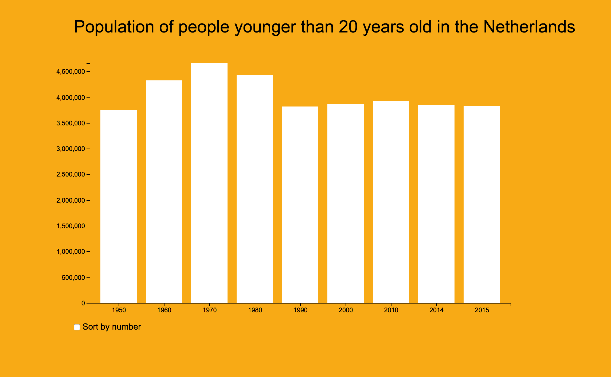

# Assessment 2



This data visualisation represents the population numbers of the Netherlands in the years 1950, 1960, 1970, 1980, 1990, 2000, 2010, 2014 and 2015, as cleaned from [cbs.nl](https://www.cbs.nl/).

## Background:
The purpose of this data visualisation is to show the population differences of people younger than 20 years old over 6 decades in the Netherlands. The data has been sorted by year, but you can also view the data sorted by number of people, in which case you can see when the population was the highest.

The data has been cleaned from [cbs.nl](https://www.cbs.nl/) and the basic barchart was taken from the [Bar Chart](https://bl.ocks.org/mbostock/3885304), created by Mike Bostock. The code has been altered by myself to look and work the way it does.

## Data:

The following is a snippet from the cleaned data set:

```
1950JJ00,10026773,4998251,5028522,10026773,3742499,2951369,2562311,670995,99599,819,679,140,10026773,,,,,,,,,,,2535,245,2290,393,,309
1960JJ00,11417254,5686152,5731102,11417254,4331042,3098779,2968611,864423154399,882,714,168,11417254,,,,,,,,,,,3171,387,2784,356,,352
```

After cleaning, the dataset is formatted in the CSV format and displays the date (1950JJ00), the total population (10026773), the total population men (4998251), the total population women (5028522), the total population again, the total population of people younger than 20 years old (3742499), which I'm using, and a couple of other numbers related to the population which I won't be using.

The data `1950JJ00` translates to the year 1950. This is the case with all the years. All of the other data are the exact numbers.

## Cleaning the data:

The original data started with the following header:
```
SET            DECIMAL = DOT.
TITLE          "Bevolking; kerncijfers".
DATA LIST      RECORDS = 3
 /1            Key0         1 -    8 (A)
               Key1        10 -   17
               Key2        19 -   25
               Key3        27 -   33
               Key4        35 -   42
               Key5        44 -   50
               Key6        52 -   58
               Key7        60 -   66
               Key8        68 -   74
 /2            Key9         1 -    6
               Key10        8 -   11
               Key11       13 -   16
               Key12       18 -   21
               Key13       23 -   30
               Key14       32 -   39 (A)
               Key15       41 -   47 (A)
               Key16       49 -   52 (A)
               Key17       54 -   60 (A)
               Key18       62 -   68 (A)
               Key19       70 -   75 (A)
 /3            Key20        1 -    6 (A)
               Key21        8 -   13 (A)
               Key22       15 -   20 (A)
               Key23       22 -   27 (A)
               Key24       29 -   32
               Key25       34 -   37
               Key26       39 -   42
               Key27       44 -   47
               Key28       49 -   51 (A)
               Key29       53 -   55.

BEGIN DATA
```

**Step 1:**
After loading in the data, this was the first section that had to be removed from the dataset. I used the following code to remove this:
```
var header = doc.indexOf('BEGIN DATA');
var end = doc.indexOf('\n', header);
doc = doc.slice(end).trim();
```

**Step 2:**
The dataset also featured a footer section that had to be removed. This section came after the line `END DATA.` so I could remove this almost exactly the way I removed the header:
```
var footer = doc.indexOf('END DATA.');
doc = doc.substring(0, footer).trim();
```

**Step 3:**
After removing the header and footer I had to take care of all the unnecessary whitespace, periods and enters within the data. I did this by writing the following code:
```
doc = doc.replace(/ \n/g, '')
doc = doc.replace(/ +/g, ',');
doc = doc.replace(/\./g, '');
```

**Step 4:**
Lastly, the data needed to be formatted into the CSV format. I did this by writing the following code:
`var data = d3.csvParseRows(doc, map);`

and the following function map:
```
function map(d) {
  return {
    year: Number(d[0].slice(0, 4)),
    populationTotal: Number(d[1]),
    population: Number(d[5])
  }
}
```

Now, the dataset has been cleaned.

## Interaction:

You can interact with this bar chart by sorting the given data either by year (default, unchecked) or by population (checked).

## Features:

### D3 Features:

* [d3.text](https://github.com/d3/d3-request/blob/master/README.md#text) `d3.text('data.txt')`
* [d3.max](https://github.com/d3/d3-array/blob/master/README.md#max) `y.domain([0, d3.max(data, population)]);`
* [d3.timeout](https://github.com/d3/d3-timer/blob/master/README.md#timeout) `var timeout = d3.timeout(change, 2000);`
* [d3.transition](https://github.com/d3/d3-transition/blob/master/README.md#transition) `var transition = svg.transition();`
* [d3.ascending](https://github.com/d3/d3-array/blob/master/README.md#ascending) `return d3.ascending(year(a), year(b));`
* [d3.scaleBand](https://github.com/d3/d3-scale/blob/master/README.md#scaleBand) `var x = d3.scaleBand().padding(0.2);`
* [scaleLinear](https://github.com/d3/d3-scale/blob/master/README.md#scaleLinear) `var yFocus = d3.scaleLinear().range([heightFocus, 0]);`

### Features humans can understand:

* Sorting the chart by year
* Sorting the chart by population
* Tooltip showing the exact population

## License:
**Original Chart created by:** Mike Bostock. GNU General Public License, version 3.
**Tooltip created by:** Sami Rubenfeld.
**Dataset taken from:** CBS.

&copy; Max de Vries
